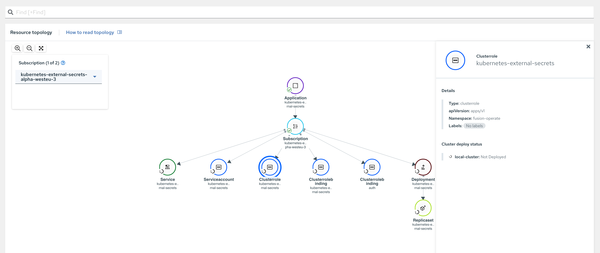

# ACM Operator repo

## What does it mean to onboard a Team?

1. New `git` repo created
1. ACM granted RO access to the repo
1. New tenant added to [projects](/projects) folder
    1. `gitops` repository defined in `channels` section
    1. `gitops` repository reference secret from previous step
    1. `helm` repository defined in `channels` section
1. Install tenant helm chart in ACM ARO cluster

    ```bash
    make deploy <project_name>
    ```

## Application lifecycle

### Creating a new application

1. `feature/new-app-<application_name>` branch created in the teams gitops repository
1. `Application` Resource Definition added to `applications` folder in teams gitops repository
1. `Subscription` Resource Definition added to respective zone in `zones` folder
1. PR raised for the changes, which trigger basic checks: syntax checks
1. Once PR is  merged, changes automatically picked up by ACM and deployed to the cluster

### Deploy an existing application

1. Developer submits PR for the application code changes
1. PR merge trigggers a release pipeline
1. Release pipeline modifies application version for the dev env in teams gitops repository
1. ACM deploys application to the respective environment
1. Pipelines polls ACM to validate status of deployment
1. Pipeline executes tests against environment
1. Once deployment succedded and user confirmation required to proceed with deployment into uppper environments
1. Pipeline repeats steps 3-7 for upper environments

### Mappings

* Zone -> Cluster Namespace
* Tenant -> Namespace

---

## Tips

### Force subscription reconcile

```bash
oc label subscriptions.apps.open-cluster-management.io the_subscription_name reconcile=true
```

## Open questions

1. How to know latest reconcile state?
1. How to know/detect reconcile errors?
1. How to force reconcile from UI?
1. How to detect git checkout errors?
1. Onboard applications already deployed to the cluster
1. Application deployment across multiple environments hosted on the same cluster
1. Strategy for multi-cloud
    * Central ACM to rule them all
    * ACM per cloud provider
1. Strategy for nonprod and prod environments:
    * Central ACM to rule them all
    * ACM per environment
1. Monitoring / alerting
1. Recovery strategy

## Known issues

### UI

1. UI doesn't show status of managed object
1. UI doesn't show target cluster of deployed object


### Reconcile errors

1. Example of git branch misconfiguration. Problem can be discovered only in ACM container logs

    ```bash
    multicluster-operators-standalone-subscription I0429 12:38:33.048544       1 subscription_controller.go:291] Exit Reconciling subscription: fusion-operate/fusion-operate
    multicluster-operators-standalone-subscription E0429 12:38:33.141429       1 gitrepo.go:198] couldn't find remote ref "refs/heads/master"Failed to git clone: couldn't find remote ref "refs/heads/master"
    multicluster-operators-standalone-subscription E0429 12:38:33.141468       1 git_subscriber_item.go:195] couldn't find remote ref "refs/heads/master"Unable to clone the git repo https://github.com/finastra-engineering/gitops-operating-platform.git
    multicluster-operators-standalone-subscription I0429 12:38:33.141483       1 git_subscriber_item.go:198] exit doSubscription: fusion-operate/fusion-operate
    multicluster-operators-standalone-subscription E0429 12:38:33.141490       1 git_subscriber_item.go:149] couldn't find remote ref "refs/heads/master"Subscription error.
    ```

### App management

1. By default ACM doesn't manage application if it wasn't deployed by ACM
